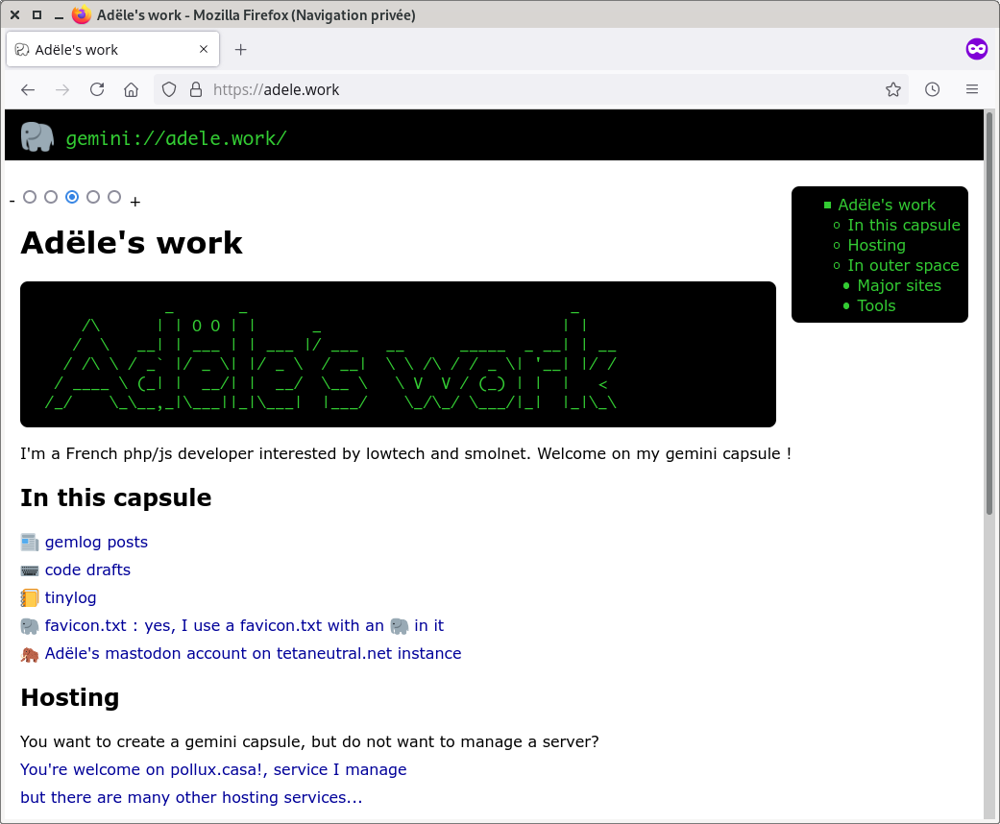

# ergol-http

Ergol companion to serve #gemini capsules through http/https.
It is a http wrapper written in php, working with ergol gemini server or standalone.



## Copyright

author : [Adële](https://adele.work/)

ergol-http is under MIT/X Consortium License

ergol-http uses and provides a copy of Twitter Emoji aka twemoji packaged in a TrueType font format.
[twemoji](https://twemoji.twitter.com/) is also published under [MIT license](http://opensource.org/licenses/MIT).

Main repository on [Codeberg](https://codeberg.org/adele.work/ergol-http).

## Installation

Clone repository or unzip archive and copy main files in the document root of your website. Copy config-sample.php to config.php and change edit config.php to adapt it.
```
cd ~/
git clone https://codeberg.org/adele.work/ergol-http.git
cd ergol-http
cp index.php style.css TwitterColorEmoji-SVGinOT.ttf .htaccess /var/www/
cp config-sample.php /var/www/config.php
nano /var/www/config.php
```

Web server needs to support url rewriting. Rule is present in .htaccess.

In Apache config:
```
RewriteEngine on
RewriteRule   "^/(.*)"  "/?q=$1"  [R,L]
```

In lighttpd config:
```
server.modules += ("mod_rewrite")
url.rewrite-once = ( "^/(.*)" => "/?q=/$1"  )
```

It is also possible to run ergol-http with php embedded web server (not the recommended way).
```
php -S 0.0.0.0:8080 -t ./ ./index.php
```

## Upgrade

Get the last version the same way as installation but do not overwrite your config.php, check if there are new constants in config-sample.php and add them into your config.php.

